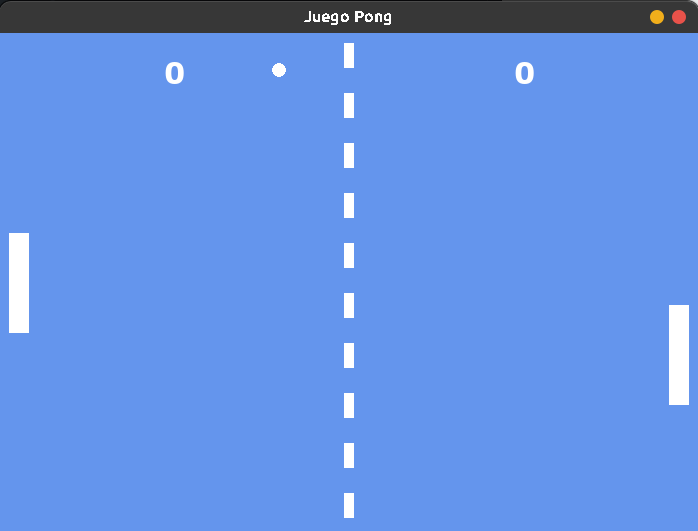
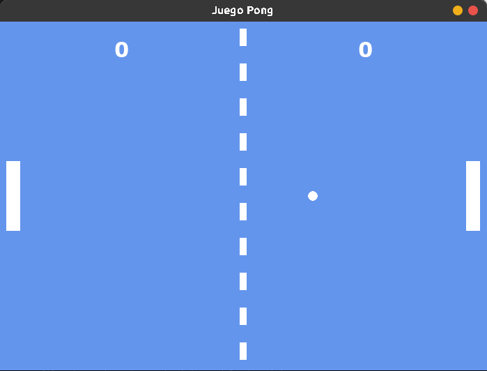
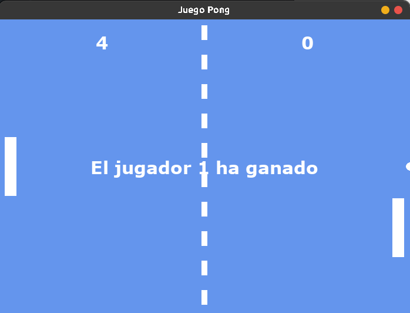

# Juego Pong - Hecho con PyGame
Es el clásico juego de Pong realizado con PyGame (Python). Está hecho para funcionar a 5 puntos, pero se puede cambiar al gusto, tiene implementadas las características como la colisión de la bolita con las barritas y el rebote cambia según dónde pegue la bolita con la barrita.

## Instrucciones para correrlo
```bash
$ python3 -m venv env
(env) $ pip install pygame
```

```bash
(env) $ python3 pong.py
```
## Imagenes de ejemplo



